This is a project to deploy a jenkins container with various tools to use for CI/CD workflows.

This is not ready for production but is intended for educational purposes.

# Project Objectives:
[CURRENT]
- Create an easier workflow to build a local Jenkins image based off the *latest* Jenkins public image.

- Deploy an initial container from this image and install all desired plugins and applications.

- Create a new image from this initial container and set that as the *new* baseline image that can be stored on a local or remote repository.

- Deploy containers from the resulting local Jenkins image to be used for various projects "as required".

[FUTURE]

- Switch to using the Jenkins Configuration as a Code (JCasC) workflow to support automated deployment including administrator accounts.

- Automate the creation of the docker image, installation of desired software applications.

- Inspect the docker image for vulnerabilities and report the results.

- Once the scanned image is approved for actual use, upload to local or remote repository within a pipeline for use by other personnel in your team or group projects.

# Build Workflow
1. Clone or download the ZIP file of this repository. Remember to set the destination file name if you use the git clone process. In this example the folder is named <jenkins_devops>. So, what we need to do is access this volume and access our password in the following path /var/jenkins_home/secrets/initialAdminPassword. 

 Move into the directory you named.

3. Review the Dockerfile and docker-compose.yaml files to get an understanding of
what is actually expected to occur when running the build process.

4. Revise the docker-compose.yaml (if desired) to what you want your Jenkins image to be named. For example, jenkins-devops. [NOTE:] You need to review the plugins.txt file to make sure you have *only* the plugins you want installed. Otherwise you will have plugins that you may not need and it will create a very large image (approximately 4 GB). The base jenkins images is around 800MB. This project will create a  much larger image due to software and plugin installation. The plugins alone takeup 1.5 GB of space.

As an alternative you can comment out the section of the Dockerfile that pulls the plugins and install plugins manually. 

5. Once you have the configuration files setup as you want, then run the following command to build your jenkins image file.

docker-compose build

Note: You should see an output similar to below:

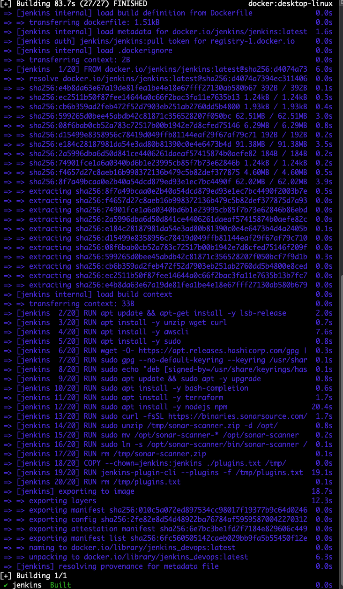

6. To verify your image was created you should review the images that are on your build system
and verify that the file name you put in the configuration file is actually present.

[NOTE:] This image can be used "as-is" for any project once you are satisfied with the results.

docker images

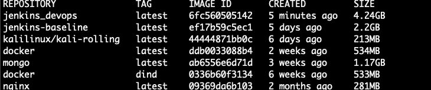

7. Create an actual container from the jenkins-devops image. We use docker compose "up" versus the usual <docker run > workflow.

- This first run we will just run <docker compose up> without the <> to just verify we can actually deploy a container from our jenkins image file. Later we will run this <detached> in order to free up our terminal/console. For the initial run it will create a volume named docker_devops. After the first run (unless you have deleted the docker_devops volume) your container will use this folder each time you run the docker compose up command.

docker compose up

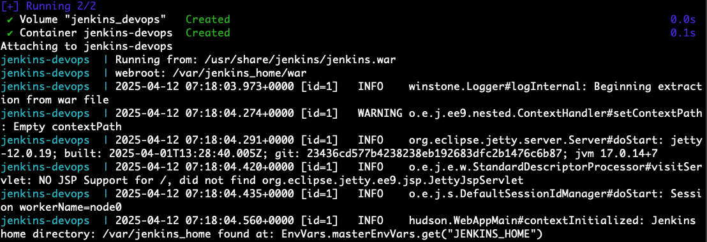

8. Now we connect to the running docker image. It should be listening on the ports you set in your configuration file.

*IF* this is the first run in this home directory then you should see the initial password for the jenkins admin user.

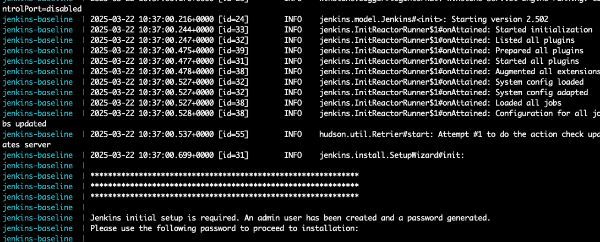

If the password is not displayed, you will need to go to the actual volume that the jenkins containers <home directory> is running on and look in the file using a text editor or the <cat> command line application to view the password.

To find your existing docker volumes run the following command:

docker volume ls

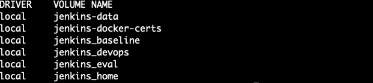

In this example the volume we need to access is named <jenkins_devops>.

] If you are using Docker Desktop, then you can access the file via the GUI:

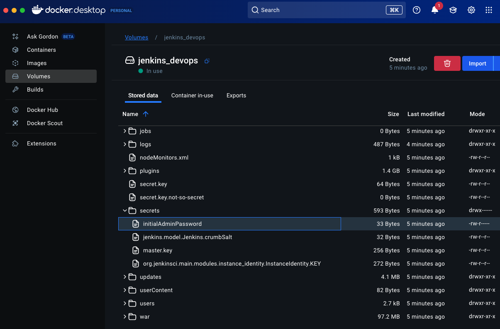

In the docker desktop application you will highlight the file you want to look at and then select for it to be downloaded to your local system.

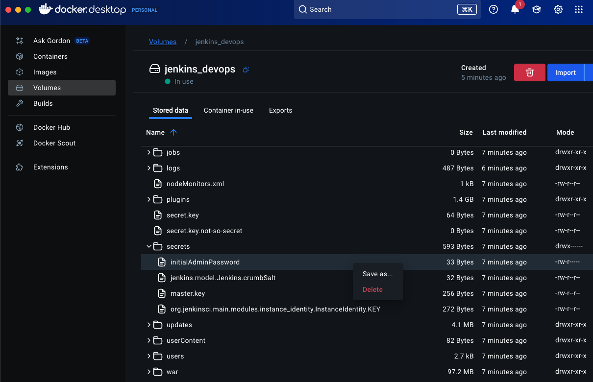

If you are running this process on a remote virtual machine that has no GUI (e.g. AWS EC2, Linode) then to accomplish the same results we run the following commands:

- Get the running image name of your jenkins container.
docker ps

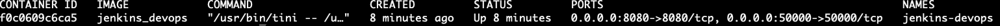

- Access the running container as an existing user on the container. You should be able to access the container as user
jenkins and read the initial password file.

docker exec -it --user jenkins <CONTAINER ID> bash

In this example our CONTAINER ID is 161c86ed8bd5 so the command I run is:
 docker exec -it --user jenkins 161c86ed8bd5 bash

You should see a console window like below:
jenkins@161c86ed8bd5:/$

- Access the initial password using the <cat> command:
cat /var/jenkins_home/secrets/initialAdminPassword 

Make a note of the password that shows in the command line.

9. Access the Jenkins web service via a web browser and start the initial setup of Jenkins.

Jenkins should be listening on the ports that are in your configuration file. In this example the jenkins service is listening on the localhost network address of 127.0.0.1 on port 8080. If you changed these settings input the IP address and/or ports you have in your configuration file.

If you are using Docker Desktop, then you can select the URL in the GUI of your running container.

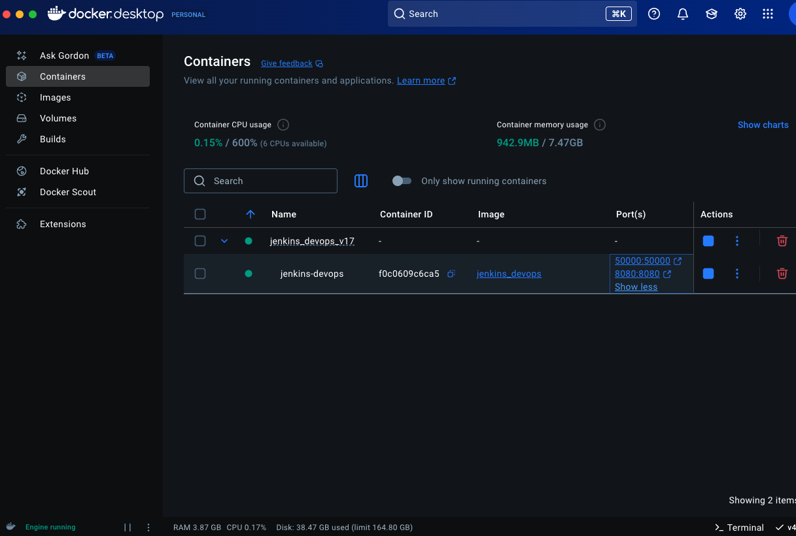

10. At the Jenkins initial setup page input the documented initial admin password and select "continue".

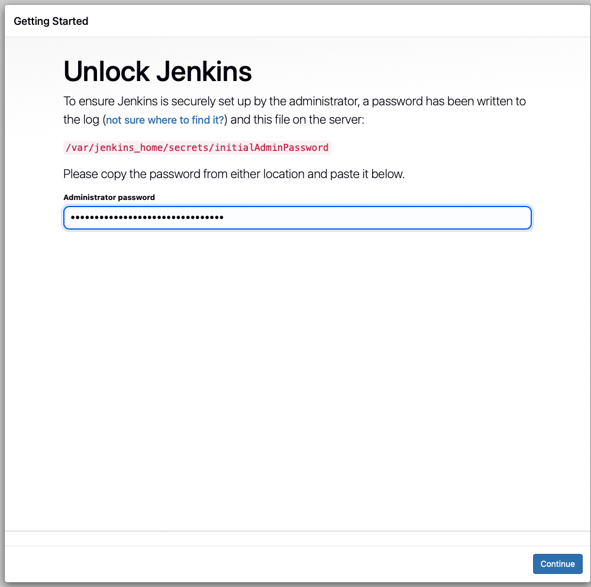

11. Select the Customize Jenkins Install suggested plugins. You will be taken to the Getting Started page. Depending on your docker host, it may take some time for the plugins to get installed.

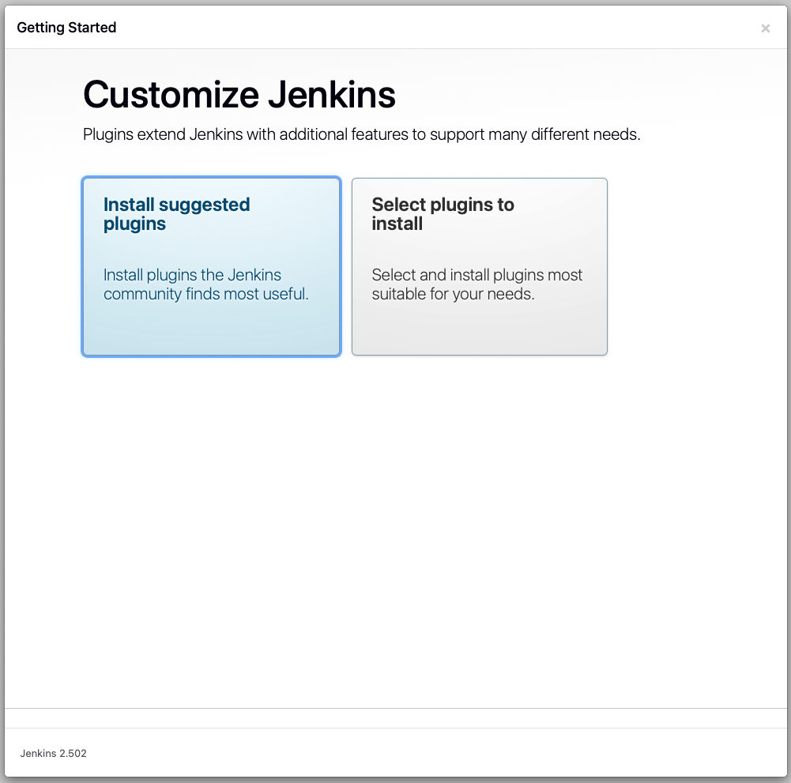

12. Input credentials for your First Admin User, then select "Save and Continue". Since the objective is to be able to deploy a docker image based off this container, you will (ONLY) use a set of default credentials for the initial admin account. 

[2ND_OPTION] You can select skip and continue as admin. 

If you select to not create a new admin account, your username will be "admin" (without quotes) and the initial password that was created by default will be the password. 

Which means you will need to access the Jenkins container on first deployment to obtain that password in the following location /var/jenkins_home/secrets/initialAdminPassword. Then you will need to login to Jenkins and change the password to a new *secure* password.

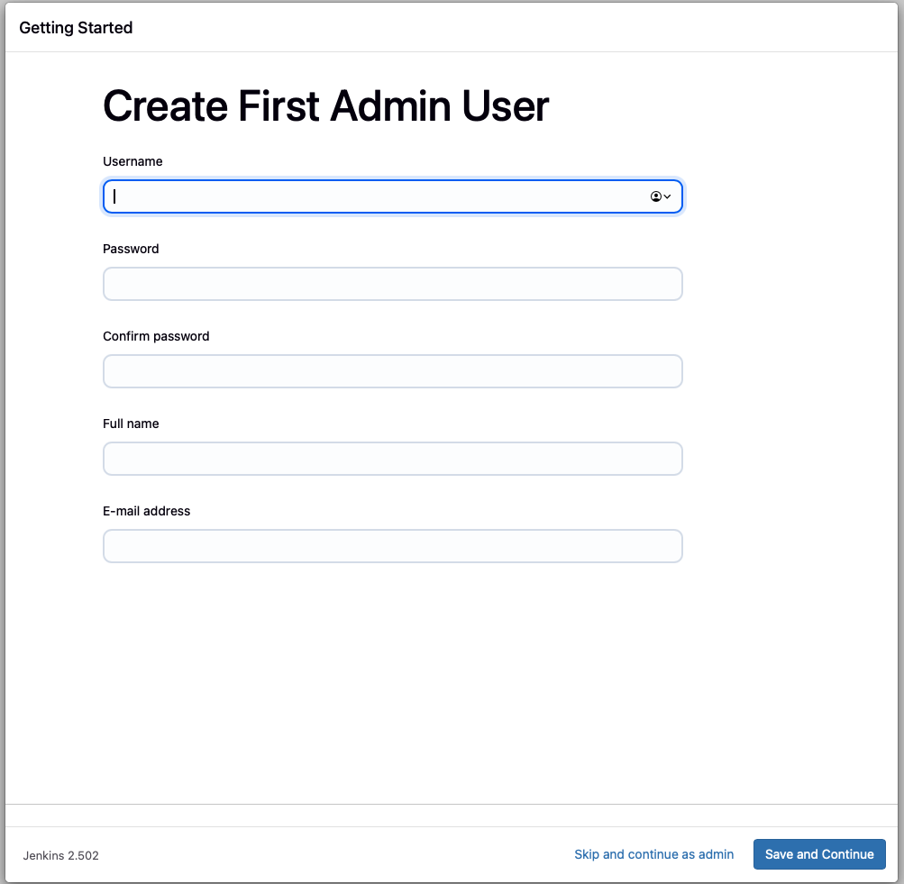

13. Set the URL that Jenkins will run on. If this is on your local system, then it will be (http://localhost:8080/). If it is running on a remote system, then set it to that address. Once you have the address input, select Save and Finish.

* In this example we use the localhost address.

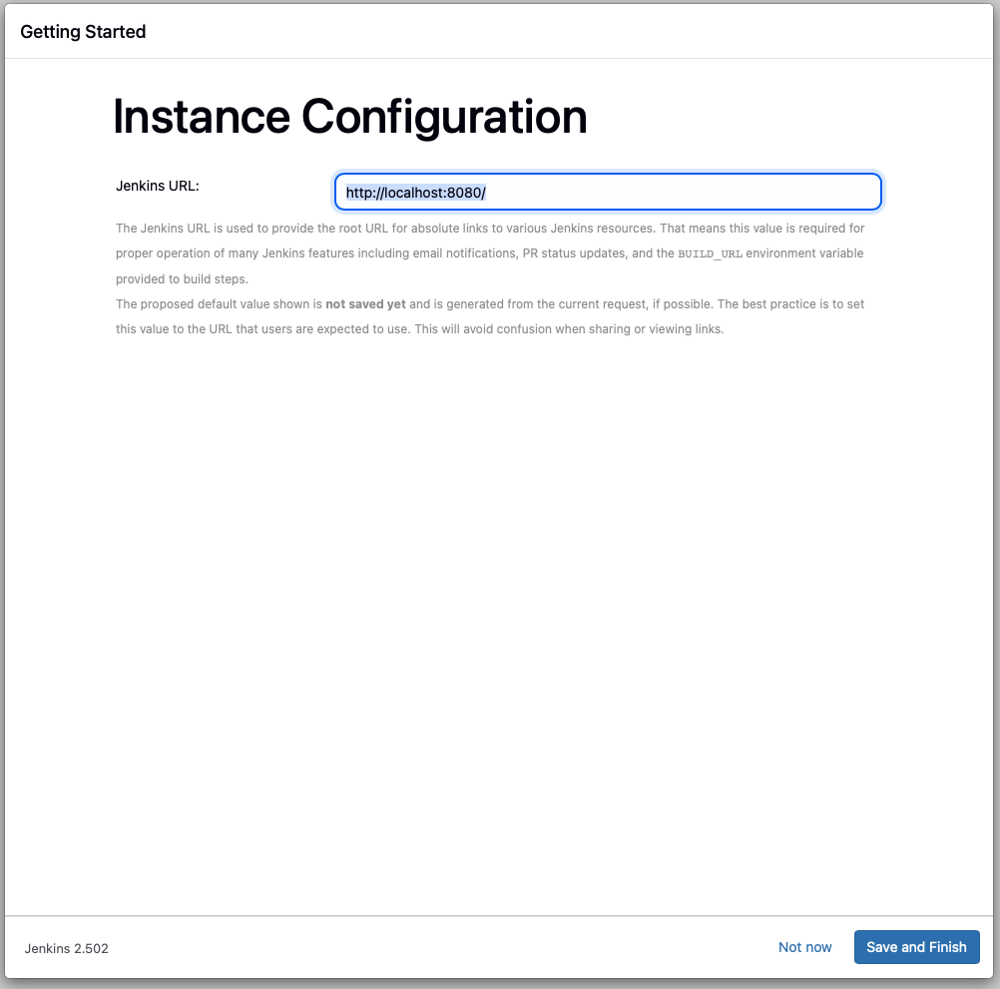

13. At this point you should see the Getting Started page. Select Start using Jenkins.

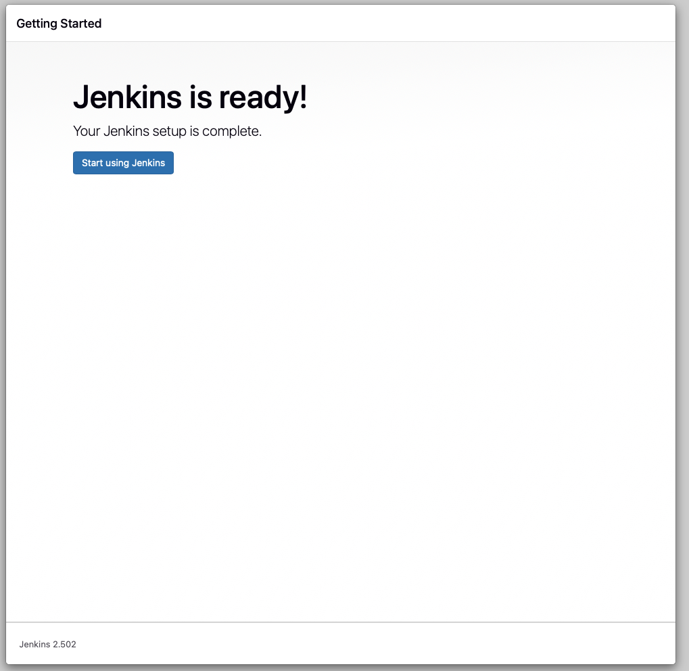

14. At this stage you should see the Jenkins dashboard. We now have a basic running Jenkins docker container. From this point you can follow any published guide or your own procedures to advance the Jenkins deployment with various software and plugins.

I have included one of my guides that can be used to help you setup a Jenkins container with CI/CD functions including Ansible, SonarQube, NodeJS, Terraform, Aqua, Amazon Web Service, Google Cloud and Kubernetes plugins. It also walks your through a basic pipeline setup.

# Prerequisites
Docker Engine or Docker Desktop installed on the system you intend to run this project.

